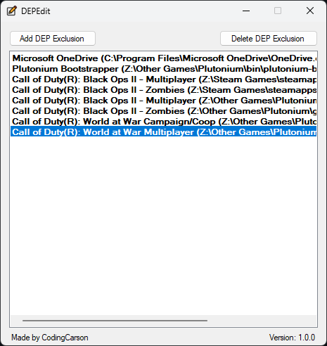

# DEPEdit
A program to easily edit the Data Execution Prevention (DEP) exclusions

## Instructions
- Download the latest release from [releases](https://github.com/TheCodingCarson/DEPEdit/releases)
- Run "DEPEdit.exe"
- Add/Remove programs you want to exclude from Data Execution Prevention (DEP) policy